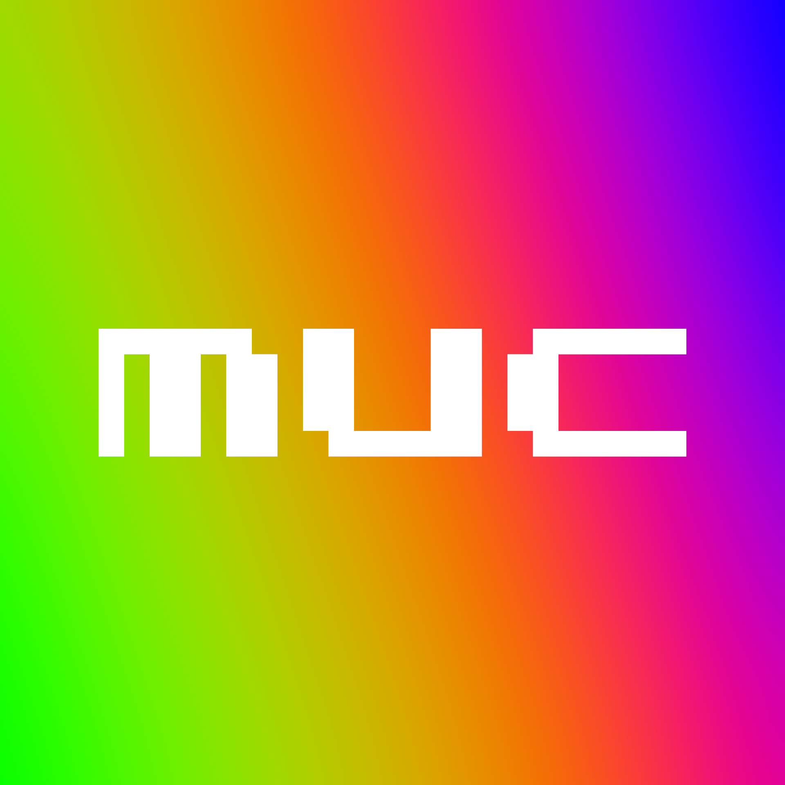

*MUC (Markov User Cloner) is a new Discord bot project of mine; it will be regularly updated, and is intended to be a public bot. While many bots exist to facilitate interaction with markov chains, I wish to create a simple open source example that people can both interact with and modify. This serves mainly as a refresher for me to try some new things in JavaScript, and as my first foray into public bot development.*               

With v1.6.x, three commands are present:

`,m clone @user` will clone a user based on their id, ~~or the keyword `all` (no @)~~ *(Temporarily disabled, will be fixed in a later update)*.
The bot uses the last 100 sent messages to generate a markov chain, filtering based on id.

`,m regen` will use the last created markov chain for your server, and generate another reply.

`,m prefix (prefix)` will change the prefix for your server.

`,m help` will send a message in chat explaining this information in a concise manner.

After testing a few potential libraries for generation, I decided upon `js-markov`. It's a bit more reslilient to longer strings. With it, I've added a new footer to the bottom of each generated message:

`M:` - Shows the number of messages that were used to generate the chain.

`O:` - The markov chain [order](https://qr.ae/pNK5KG) used.

`L:` - The maximum length for generated messages.

If you wish to run it youself, you must first install Node.JS >12. Download and unzip the repo, and create a *.env* file with your bot's token, lke this: `TOKEN=""`. Then run `npm install` and finally `node index.js`. You should see a message confrming the bot has logged in.
