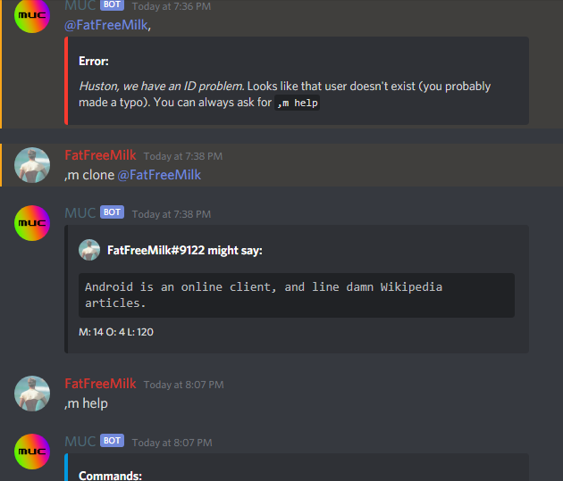

*MUC (Markov User Cloner) is a now-retired Discord bot I worked on throughout 2020. While many bots existed to facilitate interaction with Markov chains, I wanted to create an easy-to-modify open-source example to test the waters of public Discord bot development.*

 

With v1.6, three commands are present:

`,m clone @user` will clone a user based on their ID. The bot loops over the last sent messages in the channel the command was issued to generate a Markov chain, filtering based on ID. It will cap off at roughly 250 (or whatever max in the config is set to) of a particular user's messages or if there are no messages left.

`,m clone all` will clone everyone in a channel, similar to the clone command. It does not currently support regen.

`,m regen` will use the last Markov chain created for your server and generate another reply.

`,m prefix (prefix)` will change the prefix for your server; it must be ten or fewer characters.

`,m help` will send a message in chat concisely explaining this information.

After testing a few potential libraries for generation, I decided upon `js-markov`. It's a bit more resilient to longer strings. With it, I've added a new footer to the bottom of each generated message:

`M:` - Shows the number of messages used to create the chain.

`O:` - The Markov chain [order](https://qr.ae/pNK5KG) used.

`L:` - The maximum length for generated messages.

To run it yourself, you must first install *Node.JS* (working on 14.5). Next, download and unzip the repo, and create a *.env* file with your bot's token, like this: `TOKEN=""`. After that, run `npm install` and finally, `node index.js.` You should see a message confirming the bot has logged in; please see below for an example.
```
MUC logged in as: MUC#0108
cloning User#0000 in Guild Nickname
regenerating User#0000 in Guild Nickname
```
*(Information on guilds & users that use the main commands are printed to console)*
